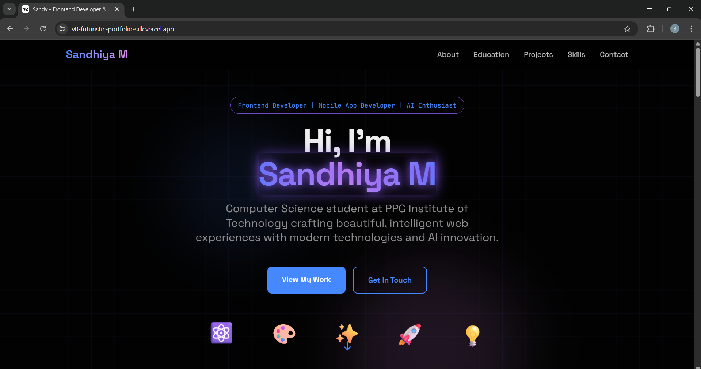
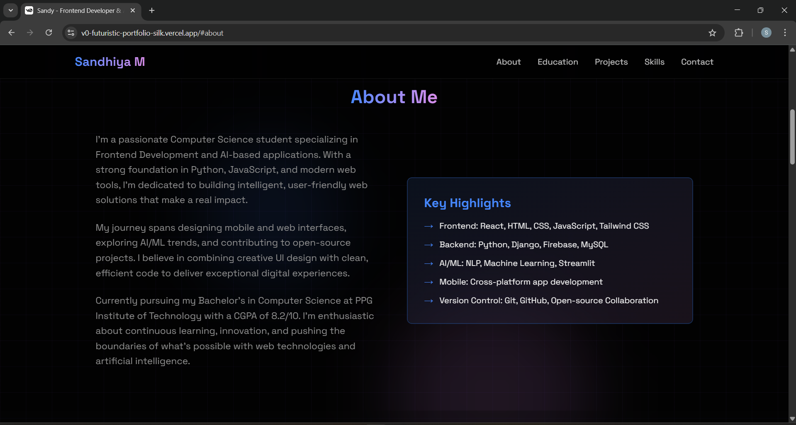
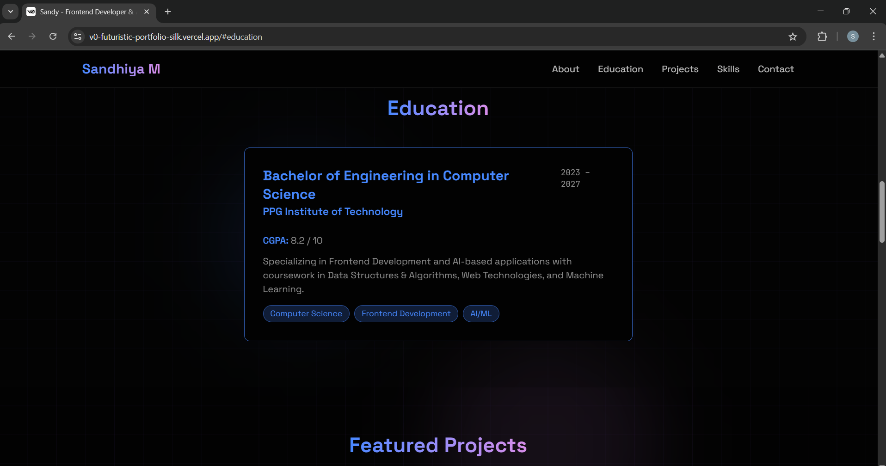
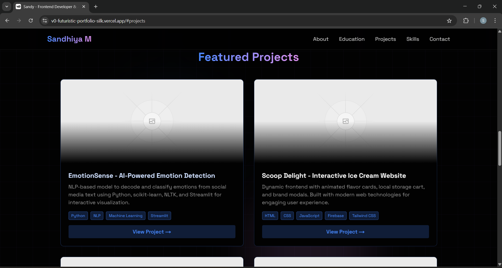
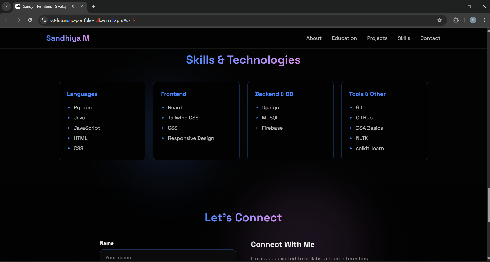
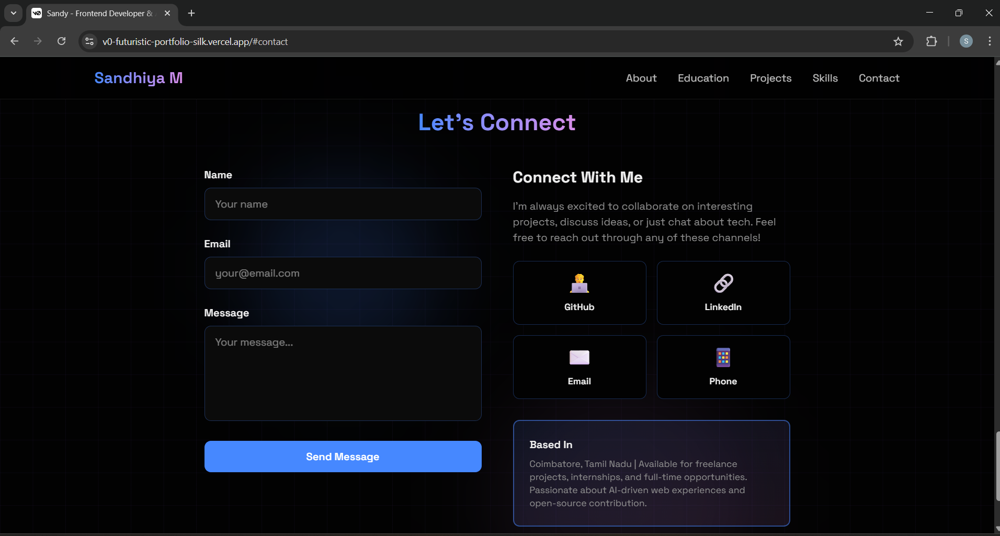

# 💫 Sandy's Futuristic Portfolio Website  

🚀 **Live Demo:** (https://v0-futuristic-portfolio-silk.vercel.app/)  

---

## 🌈 Overview  
This project is my **personal portfolio** built to showcase my journey as a  
**Frontend Developer, Mobile App Developer, and AI Enthusiast**.  
It combines a **tech-driven design** with a **vibrant and creative aesthetic**,  
making it more than just a resume — it's an experience.

---
## 📸 Project Screenshots

### 🏠 Home Page
<p align="center">
  
</p>

### ⚙ About Page
<p align="center">
  
</p>

### 🎨 Education Page
<p align="center">
  
</p>

### ⚙ Projects Page
<p align="center">
  
</p>

### ⚙ Skills-Technologies Page
<p align="center">
  
</p>

### ⚙ Contact Page
<p align="center">
  
</p>

---

## 🧩 Tech Stack  
- **HTML5** – Page Structure  
- **CSS3** – Styling, Gradients, Animations  
- **JavaScript (Vanilla)** – Dynamic Interactions  
- **Vercel** – Deployment Platform  
- **GitHub** – Version Control  

---

## ✨ Features  
✅ Fully Responsive & Optimized  
✅ Futuristic Gradient UI  
✅ Animated Navigation & Interactive Cards  
✅ Dedicated Project & Skill Sections  
✅ Deployed on Vercel  

---

## ⚙️ How to Run Locally  
```bash
git clone https://github.com/yourusername/Sandy-Futuristic-Portfolio.git
cd Sandy-Futuristic-Portfolio
# Open index.html in your browser
